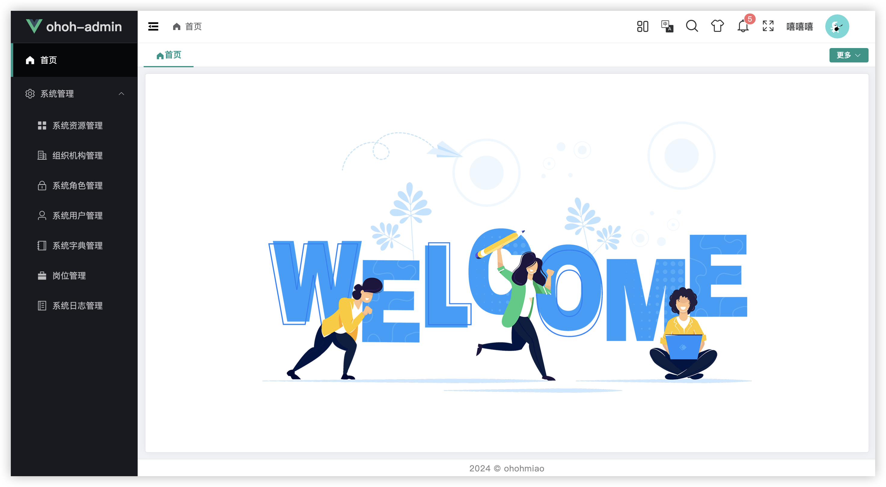

# ✨ ohoh-admin-vue3 🚀

### 项目介绍 

基于Spring Boot + Vue3前后端分离的开发脚手架。正在开发更适合咱中国宝宝体质的工作流引擎～

- 后端技术栈：Spring Boot2.7.12、MyBatis-Plus、MySQL、Redis。
- 前端采用 [Geeker-Admin](https://gitee.com/HalseySpicy/Geeker-Admin) 框架：Vue3.4、TypeScript、Vite5、Pinia、Element-Plus。
- 权限认证框架依赖 [Sa-Token](https://sa-token.cc/) 实现，让鉴权变得简单、优雅。
- RBAC权限设计，支持菜单和按钮级的动态权限控制，支持权限分级授权。
- 系统功能齐全的后端管理基础框架。
- 集成bpmn.js流程设计器，加上极简的流程配置，降低工作流具体业务开发难度，并且可自由扩展实现定制化需求。

### 代码仓库 

- Gitee：https://gitee.com/ohohmiao/ohoh-admin-vue3
- GitHub：https://github.com/ohohmiao/ohoh-admin-vue3

### 项目功能 
> 版本 2
> - 节假日管理：维护节假日数据，计算工作日。
> - 流程定义管理：支持图形化流程建模，可视化配置流程节点与审批规则。
> - 开发ing...

> 版本 1.0.0
> - 系统资源管理：配置系统菜单及按钮。
> - 系统字典管理：维护系统字典数据。
> - 组织机构管理：维护系统组织机构数据。
> - 系统角色管理：支持系统资源授权，支持按组织机构层级数据范围授权，支持配置全局公共角色。
> - 系统用户管理：维护系统用户数据，支持单用户挂靠多部门。
> - 岗位管理：维护岗位数据。
> - 系统日志管理：查询系统登录、登出、操作、异常日志。

### 文件目录 

```text
ohoh-admin-vue3
├─ ohoh-admin-server        # 后端代码
├─ ohoh-admin-client        # 前端代码
├─ db                       # 建库脚本
├─ images                   # README 图片资源
└─ README.md                # README 介绍
```
### 效果图
- bpmn.js流程设计器


- 流程配置


- 登录页


- 首页



- 全局公共角色


- 给角色授权资源


- 给角色授权用户


- 给角色授权数据


- 给用户授权角色


### Respect！！！

- [Geeker-Admin](https://gitee.com/HalseySpicy/Geeker-Admin) 
- [RuoYi-Vue-Plus](https://gitee.com/dromara/RuoYi-Vue-Plus) 
